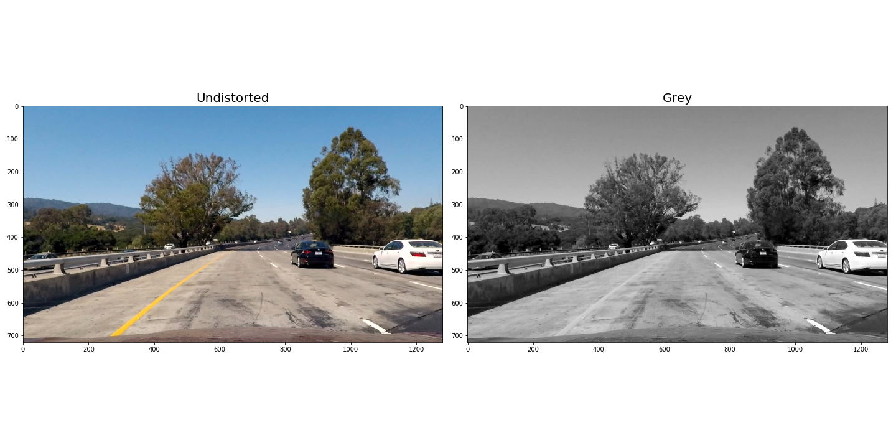
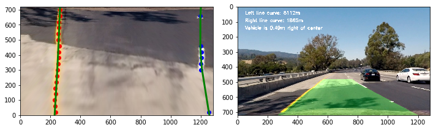

**Advanced Lane Finding Project**

The goals / steps of this project are the following:

* Compute the camera calibration matrix and distortion coefficients given a set of chessboard images.
* Apply a distortion correction to raw images.
* Use color transforms, gradients, etc., to create a thresholded binary image.
* Apply a perspective transform to rectify binary image ("birds-eye view").
* Detect lane pixels and fit to find the lane boundary.
* Determine the curvature of the lane and vehicle position with respect to center.
* Warp the detected lane boundaries back onto the original image.
* Output visual display of the lane boundaries and numerical estimation of lane curvature and vehicle position.

## Camera Calibration

### Computing the camera matrix and distortion coefficients

This was done as preparation step for lane detection.
* Read in calibration images.
* Generate object points (points to map the chessboard corners to in the undistorted image).
* Find the image points (chessboard corners) using `cv2.findChessboardCorners`.
* Calibrate the camera and obtain distortion coefficients using `cv2.calibrateCamera`.

#### Original Calibration image  

#### Corners Drawn Calibration image

#### Undistorted Calibration image

## Image Pipeline

### Apply distortion correction to each image

* Apply `cv2.undistort` with the camera matrix and distortion coefficients. 

#### Example of a distortion-corrected image: colored and grayed

### 3. Create a thresholded binary image

* Sobel on x direction (for grayscaled image)
* Sobel on y direction (for grayscaled image)
* Gradient Magnitude
* Gradient Direction
* Yellow and white color detection from RGB
* Yellow and white color detection from HSV
* HLS Threshold Colour Channel (S and L channel)

#### Example of Sobel on x direction  
  
#### Example of Sobel on y direction  

#### Example of Gradient Magnitude   
  
#### Example of Gradient Direction  
  
#### Example of HLS Threshold Colour Channel  
  
#### Example of Combined Filter Methods
 

### Perspective transform

* Select only a hard-coded region of interest using a binary mask.
* Transform the image from the car camera's perspective to a birds-eye-view perspective.
* Hard-code the source and destination polygon coordinates and obtain the matrix that maps them onto each other using `cv2.getPerspective`.
* Warp the image to the new birds-eye-view perspective using `cv2.warpPerspective` and the perspective transform matrix we just obtained.
#### Example of a transformed image
 

### Identify lane-line pixels and fit their positions with a polynomial

#### Identify lane line pixels

* Divide the image into `n` horizontal strips (steps) of equal height.
* For each step, take a count of all the pixels at each x-value within the step window using a histogram generated from `np.sum`.
* Smoothen the histogram using `scipy.signal.medfilt`.
* Remove anomalies for each line
* Use weighed average to find x coordinate for left and right lines and use middle of a strip as y.
* Add to collection of lane line pixels.  
(`LinePoints` class)

#### Fit positions of lane-line pixels with a polynomial

* Fit a second order polynomial to each lane line using `np.polyfit`.  
(`Line` class)

#### Calculate the radius of curvature of the lane and the position of the vehicle with respect to the center

The calculation of the radius of curvature of the line is obtained from the lecture. The vehicle position is determined by calculating the average x coordinate of the bottom left and bottom right points of the lines and comparing it with the middle point of the x-axis (i.e., 640).  
Deviation and Radius of Curvature are printed on each frame.  
(`Line` and `LineDetect` classes)  

#### Plot result back down onto tho road such that the lane area is identified clearly.

* Warp lane lines back onto original image using `cv2.warpPerspective`.
* Combine lane lines with original image (version corrected for distortion) using `cv2.addWeighted`.  

#### Example of a lane histogram
 

#### Tracking lanes across search windows
  
  
  
  

#### Dash cam footage with lane overlay

  
  
  
  

#### Final video

#### Optimization attempt

The idea is to do full recalculation for every 5th frame.  
Implemented using the following methods:  
* LanePoints.build_head / LanePoints.build
* Line.build_opt / Line.build
* LaneDetector.detect_opt
* LaneDetector.find_lane_opt  

It was a very simple attempt to optimize so the result is not very impressive but acceptable.  
Processing time was about 1/5 time faster and quality slightly worse.  

Result video:  
  

### Discussion

Main idea of the project is to shows what we can archive by using explicit computer vision and results are very impresive.  
But by any means that solution is not ideal and I see the following problems with my implementation.  
* Hard-Coded values. To make it works on all roads values needs to be calculated dynamically.
* Performance. To make it works on smaller devices the solution needs to be optimized.
* It needs to be improved to handle various driving conditions like: 
  - Poor lighting conditions
  - Hills
  - Roads without lane markers
* Make it more intelegent. In my openion all improvements will make that solution very complex and in some period of time the approach will need to be changed.
